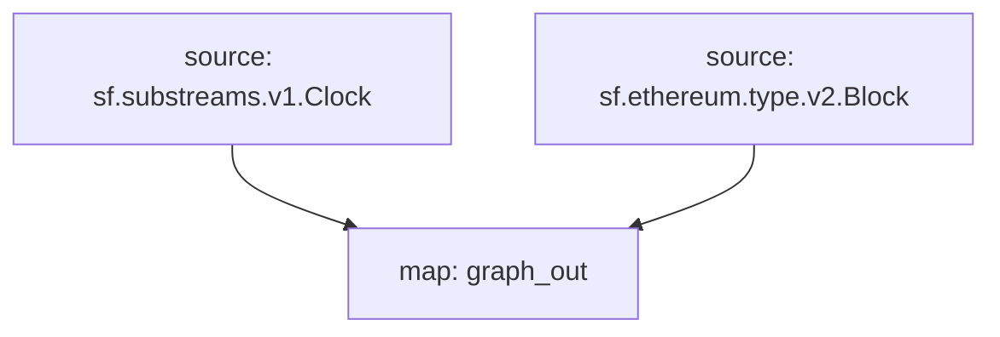

# Substreams Raw Blocks

## Raw Data

- [x] **Blocks**
  - [x] **BalanceChanges**
  - [ ] **Code Changes**
  - [ ] **System Calls**
- [x] **Logs**
- [x] **Transactions**
- [x] **Traces**
  - [x] **BalanceChanges**
  - [x] **Storage Changes**
  - [x] **Code Changes**
  - [x] **Account Creation**
  - [x] **Gas Changes**
  - [x] **Nonce Changes**

## Supported Networks

- **no-EVM**
  - [ ] Bitcoin
  - [ ] Solana
  - [ ] Near
  - [ ] Cosmos Hub
  - [ ] StartNet
  - [ ] Aptos
  - [ ] SUI
  - [ ] TON
- **EVM**
  - [x] Ethereum
    - [x] Sepolia Testnet
  - [x] BNB
    - [x] Chapel Testnet
  - [x] Polygon
  - [ ] Fantom
  - [ ] zkSync
  - [ ] [Gravity](https://gravity.xyz/)
  - [ ] ~~[Avalanche-C](https://avax.network/)~~
  - [ ] [SEI](https://www.sei.io/)
  - [ ] [Harmony](https://www.harmony.one/)
  - [ ] [Aurora](https://aurora.dev/) (L2 on NEAR protocol)
  - [ ] [Rootstock](https://rootstock.io/) (L2 on Bitcoin)
  - [ ] [IoTex](https://iotex.io/)
  - [ ] [Celo](https://celo.org/) (L2 on ETH)
  - [ ] [Gnosis]
    - [ ] Chiado Testnet
- **Optimistic Rollup (EVM)**
  - [x] Base
  - [x] Arbitrum One (L2 on ETH)
    - [x] Arbitrum Sepolia (Testnet)
  - [ ] Arbitrum Nova (L2 on ETH using AnyTrust protocol)
  - [ ] ~~Optimism (OP)~~
  - [ ] [opBNB](https://docs.bnbchain.org/bnb-opbnb/)
  - [ ] ~~Blast~~
  - [x] Mode
  - [x] Zora
  - [ ] [~~Boba~~](https://boba.network/)
  - [ ] [BobaBNB](https://boba.network/)
  - [ ] [Combo](https://combonetwork.io/) (L2 on BNB)
  - [x] [Xai](https://xai.games/) (L3 on Arbitrum)
- **Cosmos ecosystem**
  - [ ] ~~[Injective](https://injective.com/)~~ (L2 on Cosmos)
  - [ ] Osmosis (L1)
  - [ ] DyDx
  - [ ] Celastia
  - [ ] Akash
  - [ ] Nobel
  - [ ] [Kava](https://www.kava.io/)
  - [ ] [Cronos](https://cronos.org/) (POS)
  - [ ] [Cronos](https://cronos.org/) (EVM)
  - [ ] [Cronos](https://cronos.org/) (zkEVM)
- **Polygon's Validium**
  - [ ] [~~X-Layer~~](https://www.okx.com/xlayer) (L2 on Polygon)
- **ZK Rollup (EVM)**
  - [ ] Scroll
  - [x] Linea
  - [ ] ~~[Fuse](https://www.fuse.io/)~~ (L2 on Polygon)
  - [ ] [zkBNB](https://docs.bnbchain.org/zkbnb/)
  - [ ] [Polygon zkEVM](https://polygon.technology/polygon-zkevm)
  - [ ] [Astar zkEVM](https://astar.network/) (L2)
    - [ ] zKatana Testnet
- **Polkadot's Parachain**
  - [ ] Moonbeam
  - [ ] Moonriver
  - [ ] [Astar](https://astar.network/) (L1)
- **Tezos Smart Rollups**
  - [ ] Etherlink

## SQL

```sql
CREATE TABLE IF NOT EXISTS blocks
(
    time                    DateTime,
    number                  UInt64,
    date                    Date,
    hash                    String,
    parent_hash             String,
    nonce                   UInt64,
    ommers_hash             String,
    logs_bloom              String,
    transactions_root       String,
    state_root              String,
    receipts_root           String,
    miner                   String,
    difficulty              Int64,
    total_difficulty        Decimal(38, 0),
    size                    String,
    mix_hash                String,
    extra_data              String,
    gas_limit               UInt64,
    gas_used                UInt64,
    blob_gas_used           UInt64,
    transaction_count       String,
    base_fee_per_gas        String,
    parent_beacon_root      String
)
    ENGINE = ReplacingMergeTree()
        PRIMARY KEY (hash)
        ORDER BY (hash);
```

## Data Visualization

- Dune's spellbook
- Snowflake
- BigQuery
- Databricks
  <https://docs.databricks.com/en/connect/storage/amazon-s3.html>
- Clickhouse
- Postgres
- Amazon Redshift
  <https://aws.amazon.com/redshift/>

## Graph



## Export to Parquet & CSV

```sql
SELECT *
FROM blocks
WHERE date='2024-08-03'
INTO OUTFILE 'eth_2024-08-03_blocks.parquet'
FORMAT Parquet
```

```sql
SELECT *
FROM blocks
WHERE date='2024-08-03'
INTO OUTFILE 'eth_2024-08-03_blocks.csv'
FORMAT CSVWithNames
```
