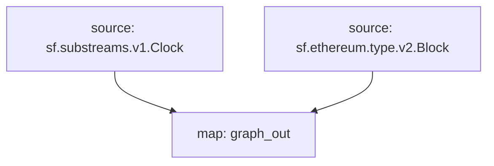

# Substreams Raw Blocks

## Supported Networks

- [x] EVM
  - [x] Ethereum
  - [x] Arbitrum
  - [x] BNB
  - [x] Optimism (OP)
  - [x] Avalanche-C
  - [x] Polygon
- [ ] Bitcoin
- [ ] Solana

## Raw Data

- [x] Blocks
- [x] Logs
- [ ] Transactions
- [ ] Traces
  - [ ] Creation Traces

## Data Visualization

- Dune's spellbook
- Snowflake
- BigQuery
- Databricks
  https://docs.databricks.com/en/connect/storage/amazon-s3.html
- Clickhouse
- Postgres
- Amazon Redshift
  https://aws.amazon.com/redshift/

## Graph

