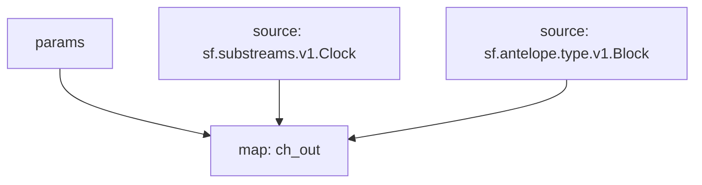

# Antelope Transactions Substreams

> EOS, WAX, Telos, Ultra...
> [`sf.antelope.type.v1.Block`](https://buf.build/pinax/firehose-antelope/docs/main:sf.antelope.type.v1)

- [x] **Blocks**
- [x] **Transactions**
- [x] **Actions**
  - [x] **Authorization**
  - [x] **Receiver**

## Substreams Graph

