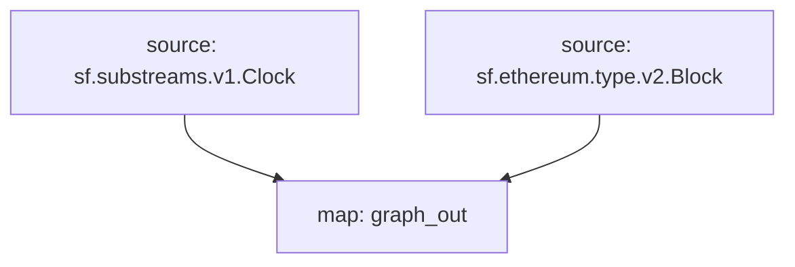

# Substreams Raw Blocks

## Supported Networks

- [x] EVM
  - [x] Ethereum
  - [x] Arbitrum
  - [x] BNB
  - [x] Optimism (OP)
  - [x] Avalanche-C
  - [x] Polygon
- [ ] Bitcoin
- [ ] Solana

## Raw Data

- [x] Blocks
- [x] Logs
- [ ] Transactions
- [ ] Traces
  - [ ] Creation Traces

## SQL

```sql
CREATE TABLE IF NOT EXISTS blocks
(
    time                    DateTime,
    number                  UInt64,
    date                    Date,
    hash                    String,
    parent_hash             String,
    nonce                   UInt64,
    ommers_hash             String,
    logs_bloom              String,
    transactions_root       String,
    state_root              String,
    receipts_root           String,
    miner                   String,
    difficulty              Int64,
    total_difficulty        Decimal(38, 0),
    size                    String,
    mix_hash                String,
    extra_data              String,
    gas_limit               UInt64,
    gas_used                UInt64,
    blob_gas_used           UInt64,
    transaction_count       String,
    base_fee_per_gas        String,
    parent_beacon_root      String
)
    ENGINE = ReplacingMergeTree()
        PRIMARY KEY (hash)
        ORDER BY (hash);
```

## Data Visualization

- Dune's spellbook
- Snowflake
- BigQuery
- Databricks
  https://docs.databricks.com/en/connect/storage/amazon-s3.html
- Clickhouse
- Postgres
- Amazon Redshift
  https://aws.amazon.com/redshift/

## Graph

