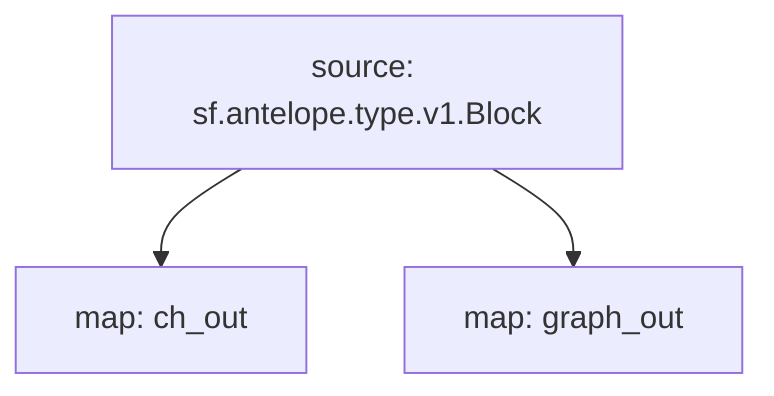

# Antelope Transactions Substreams

> Transactions, Decoded Actions & Database Operations
> WAX, EOS, Ultra, Telos...
> [`sf.antelope.type.v1.Block`](https://buf.build/pinax/firehose-antelope/docs/main:sf.antelope.type.v1)

- [x] **Blocks**
- [x] **Transactions**
  - [x] **DatabaseOperations**
- [x] **Actions**
  - [x] **Authorization**
  - [x] **Receiver**

## Support For

- [x] Subgraph `graph_out`
- [x] Clickhouse `ch_out`
- [ ] ~~Postgres~~

