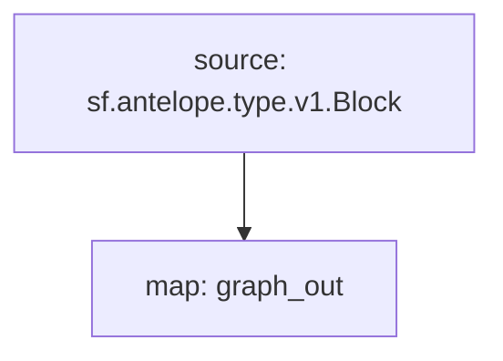

# Subgraph: `Antelope Transactions`

> Transactions, Decoded Actions & Database Operations
>
> WAX, EOS, Ultra, Telos...
> [`sf.antelope.type.v1.Block`](https://buf.build/pinax/firehose-antelope/docs/main:sf.antelope.type.v1)

- [x] **Blocks**
- [x] **Transactions**
  - [x] **DatabaseOperations**
- [x] **Actions**
  - [x] **Authorization**
  - [x] **Receiver**

## Chains

- **API Key**: https://thegraph.com/studio/apikeys/
- **Base URL**: https://gateway.thegraph.com/api
- **Query URL format**: `{base_url}`/api/`{api-key}`/subgraphs/id/`{subgraph_id}`

| Chain | Subgraph ID |
| ----- | ----------- |
| WAX   | [`4bAe7NA8b6J14ZfZr3TXfzzjjSoGECTFuqv7CwnK1zzg`](https://thegraph.com/explorer/subgraphs/4bAe7NA8b6J14ZfZr3TXfzzjjSoGECTFuqv7CwnK1zzg?view=Query&chain=arbitrum-one) |
| EOS   | [`2RNdhL5p62dGN5UqKtsSEhYZiTJbFcuuhzk9qRJj8QeU`](https://thegraph.com/explorer/subgraphs/2RNdhL5p62dGN5UqKtsSEhYZiTJbFcuuhzk9qRJj8QeU?view=Query&chain=arbitrum-one) |

## GraphQL

```graphql
{
  actions(
    where: {isNotify: false, account: "eosio.token"}
    orderBy: block__number
    orderDirection: desc
  ) {
    block{
      number
      time
    }
    transaction {
      id
    }
    account
    name
    jsonData
    dbOps {
      code
      tableName
      primaryKey
      newDataJson
    }
  }
}
```

## Substreams Modules

