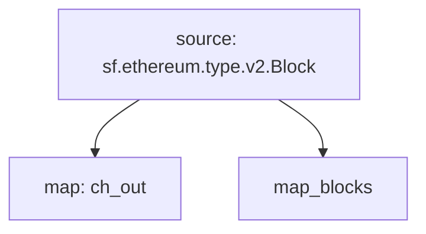

# Substreams Raw Blocks

## `EVM` Raw Blockchain Data
> Ethereum, Base, Arbitrum One, Polygon, BNB...

- [x] **Blocks**
  - [x] **BalanceChanges** (EXTENDED)
  - [x] **Code Changes** (EXTENDED)
  - [x] **System Calls** (EXTENDED)
- [x] **Logs**
- [x] **Transactions**
- [x] **Traces** (EXTENDED)
  - [x] **BalanceChanges**
  - [x] **Storage Changes**
  - [x] **Code Changes**
  - [x] **Account Creation**
  - [x] **Gas Changes**
  - [x] **Nonce Changes**

## `Solana` Raw Blockchain Data

- [ ] **Blocks**
- [ ] **Transactions**
- [ ] **Instruction Calls**
- [ ] **Account Activity**
- [ ] **Discriminators**
- [ ] **Rewards**
- [ ] **Vote Transactions**

## Substreams Graph

