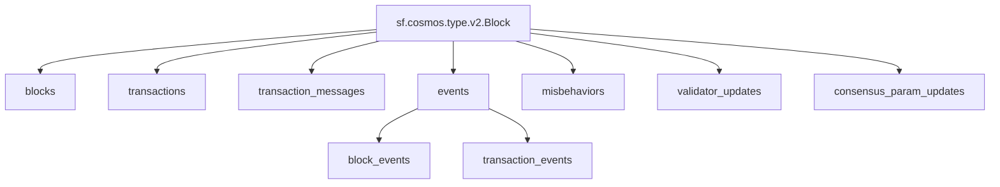

# Substreams Raw Blocks

## `EVM` Raw Blockchain Data
>
> Ethereum, Base, Arbitrum One, Polygon, BNB...
> [`sf.ethereum.type.v2.Block`](https://buf.build/streamingfast/firehose-ethereum/docs/main:sf.ethereum.type.v2)

- [x] **Blocks**
  - [x] **BalanceChanges** (EXTENDED)
  - [x] **Code Changes** (EXTENDED)
  - [x] **System Calls** (EXTENDED)
- [x] **Logs**
- [x] **Transactions**
- [x] **Traces** (EXTENDED)
  - [x] **BalanceChanges**
  - [x] **Storage Changes**
  - [x] **Code Changes**
  - [x] **Account Creation**
  - [x] **Gas Changes**
  - [x] **Nonce Changes**

## `Solana` Raw Blockchain Data

> Solana
> [`sf.solana.type.v1.Block`](https://buf.build/streamingfast/firehose-solana/docs/main:sf.solana.type.v1)

- [x] **Blocks**
- [x] **Transactions**
- [x] **Instruction Calls**
- [x] **Account Activity**
- [x] **Rewards**
- [x] **Vote Transactions**
- [x] **Vote Instruction Calls**
- [x] **Vote Account Activity**
- ~~[ ] **Discriminators**~~

## `Antelope` Raw Blockchain Data

> EOS, WAX, Telos, Ultra...
> [`sf.antelope.type.v1.Block`](https://buf.build/pinax/firehose-antelope/docs/main:sf.antelope.type.v1)

- [x] **Blocks**
  - [ ] **Savanna Merkle Roots**
- [x] **Transactions**
  - [x] **Feature Operations**
  - [x] **Permission Operations**
    - [x] **Authority.Accounts**
    - [x] **Authority.Keys**
    - [x] **Authority.Waits**
  - [x] **RAM Operations**
  - [x] **Table Operations**
  - [x] **Creation Tree**
  - [ ] ~~**Deferred Transactions**~~
- [x] **Actions**
  - [x] **Authorization**
  - [x] **Auth Sequence**
  - [x] **Account RAM Deltas**
- [x] **Database Operations**

## Substreams Graph

## `Cosmos` Raw Blockchain Data

> Cosmos
> [`sf.cosmos.type.v2.Block`](https://buf.build/streamingfast/firehose-cosmos/docs/main:sf.cosmos.type.v2)

- [x] **Blocks**
- [x] **Transactions**
- [x] **Transaction Messages**
- [x] **Events**
  - [x] **Block Events**
  - [x] **Transaction Events**
- [x] **Misbehaviors**
- [x] **Validator Updates**
- [x] **Consensus Param Updates**

