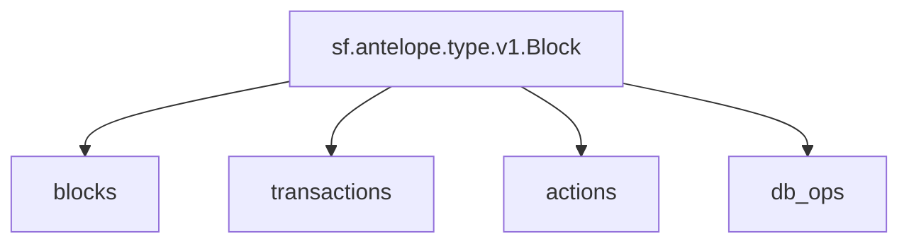

## `Antelope` Raw Blockchain Data

> EOS, WAX, Telos, Ultra...
> [`sf.antelope.type.v1.Block`](https://buf.build/pinax/firehose-antelope/docs/main:sf.antelope.type.v1)

- [x] **Blocks**
  - [ ] **Savanna Merkle Roots**
- [x] **Transactions**
  - [x] **Feature Operations**
  - [x] **Permission Operations**
    - [x] **Authority.Accounts**
    - [x] **Authority.Keys**
    - [x] **Authority.Waits**
  - [x] **RAM Operations**
  - [x] **Table Operations**
  - [x] **Creation Tree**
  - [ ] ~~**Deferred Transactions**~~
- [x] **Actions**
  - [x] **Authorization**
  - [x] **Auth Sequence**
  - [x] **Account RAM Deltas**
- [x] **Database Operations**

## Substreams Graph

