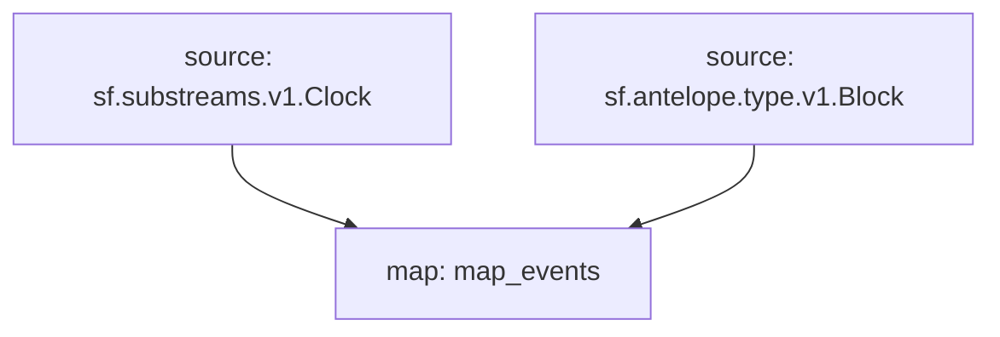

## `Antelope` Raw Blockchain Data

> EOS, WAX, Telos, Ultra...
> [`sf.antelope.type.v1.Block`](https://buf.build/pinax/firehose-antelope/docs/main:sf.antelope.type.v1)

- [x] **Blocks**
  - [x] **Savanna Merkle Roots**
- [x] **Transactions**
  - [x] **Feature Operations**
  - [x] **Permission Operations**
    - [x] **Authority.Accounts**
    - [x] **Authority.Keys**
    - [x] **Authority.Waits**
  - [x] **RAM Operations**
  - [x] **Table Operations**
  - [x] **Creation Tree**
  - [ ] ~~**Deferred Transactions**~~
- [x] **Actions**
  - [x] **Authorization**
  - [x] **Auth Sequence**
  - [x] **Account RAM Deltas**
- [x] **Database Operations**

## Graph



## Modules

```bash
Name: map_events
Initial block: 0
Kind: map
Input: source: sf.substreams.v1.Clock
Input: source: sf.antelope.type.v1.Block
Output Type: proto:pinax.antelope.v1.Events
Hash: 8490866fe98ab7d3f811ccf0f18da3cb46a378f9
```
