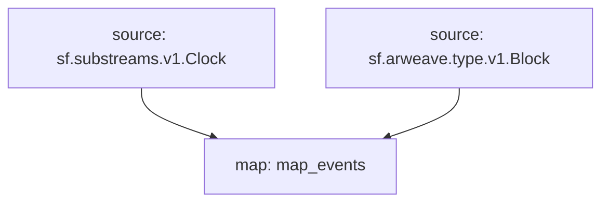

# `Arweave` Raw Blockchain Data

> Cosmos
> [`sf.arweave.type.v1.Block`](https://buf.build/pinax/firehose-arweave/file/main:sf/arweave/type/v1/type.proto)

- [x] **Blocks**
- [x] **Transactions**
- [x] **Transaction Tags**

## Graph



## Modules

```bash

```
