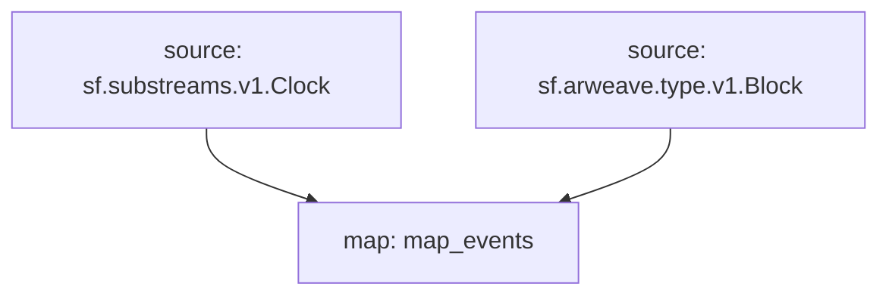

# `Arweave` Raw Blockchain Data

> Cosmos
> [`sf.arweave.type.v1.Block`](https://buf.build/pinax/firehose-arweave/file/main:sf/arweave/type/v1/type.proto)

- [x] **Blocks**
- [x] **Transactions**
- [x] **Transaction Tags**

## Graph



## Modules

```bash
Name: map_events
Initial block: 0
Kind: map
Input: source: sf.substreams.v1.Clock
Input: source: sf.arweave.type.v1.Block
Output Type: proto:pinax.arweave.v1.Events
Hash: d9116aacd7cd08060a6023b09240fbd1bbdad90b
```
