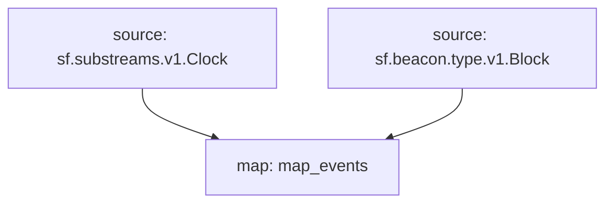

# `Beacon` Raw Blockchain Data

> Cosmos
> [`sf.beacon.type.v1.Block`](https://buf.build/pinax/firehose-beacon/docs/main:sf.beacon.type.v1)

- [x] **Block**
- [x] **Blob**
- [x] **Deposit**
- [x] **Withdrawal**
- [x] **Attestation**
- [x] **AttesterSlashing**
- [x] **BlsToExecutionChange**
- [x] **ProposerSlashing**
- [x] **VoluntaryExit**

## Graph



## Modules

```bash
Name: map_events
Initial block: 0
Kind: map
Input: source: sf.substreams.v1.Clock
Input: source: sf.beacon.type.v1.Block
Output Type: proto:pinax.beacon.v1.Events
Hash: 493ed70540e0200849b0e3ac30a0210429f768ab
```
