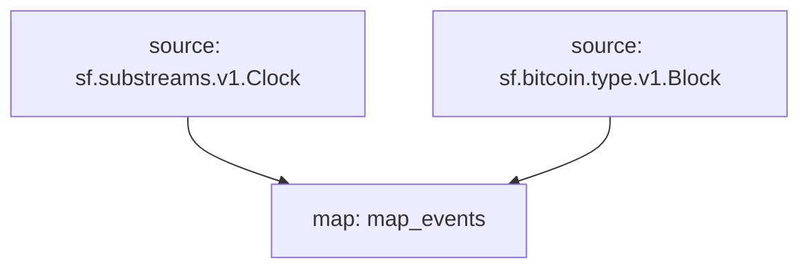

# `Bitcoin` Raw Blockchain Data

> Cosmos
> [`sf.bitcoin.type.v1.Block`](https://buf.build/streamingfast/firehose-bitcoin/docs/main:sf.bitcoin.type.v1)

- [x] **Blocks**
- [x] **Transactions**
- [x] **Inputs**
- [x] **Outputs**

## Graph



## Modules

```bash
Name: map_events
Initial block: 0
Kind: map
Input: source: sf.substreams.v1.Clock
Input: source: sf.bitcoin.type.v1.Block
Output Type: proto:pinax.bitcoin.v1.Events
Hash: ce8e6335982c5caa318902b628e433f402522277
```
