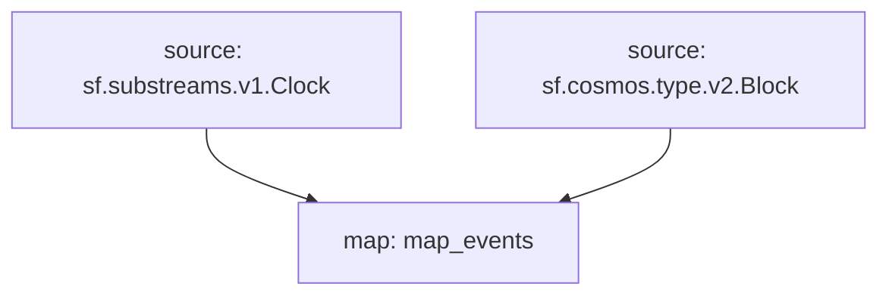

# `Cosmos` Raw Blockchain Data

> Cosmos
> [`sf.cosmos.type.v2.Block`](https://buf.build/streamingfast/firehose-cosmos/docs/main:sf.cosmos.type.v2)

- [x] **Blocks**
- [x] **Transactions**
- [x] **Transaction Messages**
- [x] **Events**
  - [x] **Block Events**
  - [x] **Transaction Events**
- [x] **Misbehaviors**
- [x] **Validator Updates**
- [x] **Consensus Param Updates**

## Graph



## Modules

```bash
Name: map_events
Initial block: 0
Kind: map
Input: source: sf.substreams.v1.Clock
Input: source: sf.cosmos.type.v2.Block
Output Type: proto:cosmos.Events
Hash: def06497ee4c721b6799dc719ea4240c887cb48c
```
