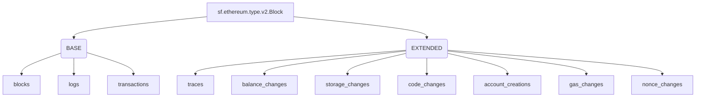

## `EVM` Raw Blockchain Data
>
> Ethereum, Base, Arbitrum One, Polygon, BNB...
> [`sf.ethereum.type.v2.Block`](https://buf.build/streamingfast/firehose-ethereum/docs/main:sf.ethereum.type.v2)

- [x] **Blocks**
  - [x] **BalanceChanges** (EXTENDED)
  - [x] **Code Changes** (EXTENDED)
  - [x] **System Calls** (EXTENDED)
- [x] **Logs**
- [x] **Transactions**
- [x] **Traces** (EXTENDED)
  - [x] **BalanceChanges**
  - [x] **Storage Changes**
  - [x] **Code Changes**
  - [x] **Account Creation**
  - [x] **Gas Changes**
  - [x] **Nonce Changes**

