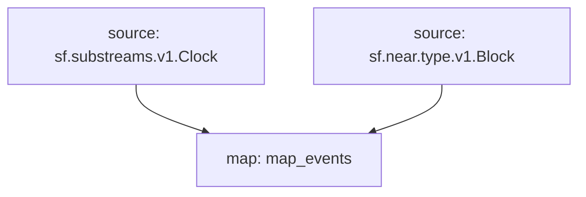

## `Near` Raw Blockchain Data
>
> Near
> [`sf.near.type.v1.Block`](https://buf.build/streamingfast/firehose-near/docs/main:sf.near.type.v1)

## Tables

- [ ] **Blocks**
- [ ] ??

## Graph



## Modules

```bash
Name: map_events
Initial block: 0
Kind: map
Input: source: sf.substreams.v1.Clock
Input: source: sf.near.type.v1.Block
Output Type: proto:pinax.near.v1.Events
Hash: ???
```
