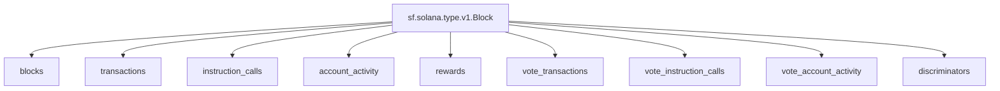

## `Solana` Raw Blockchain Data

> Solana
> [`sf.solana.type.v1.Block`](https://buf.build/streamingfast/firehose-solana/docs/main:sf.solana.type.v1)

- [x] **Blocks**
- [x] **Transactions**
- [x] **Instruction Calls**
- [x] **Account Activity**
- [x] **Rewards**
- [x] **Vote Transactions**
- [x] **Vote Instruction Calls**
- [x] **Vote Account Activity**
- ~~[ ] **Discriminators**~~

