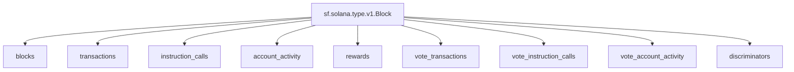
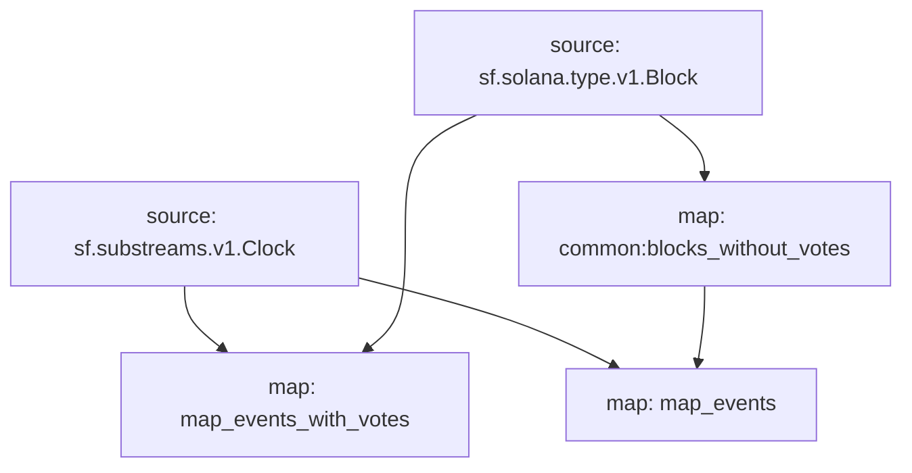

## `Solana` Raw Blockchain Data

> Solana
> [`sf.solana.type.v1.Block`](https://buf.build/streamingfast/firehose-solana/docs/main:sf.solana.type.v1)

- [x] **Blocks**
- [x] **Transactions**
- [x] **Instruction Calls**
- [x] **Account Activity**
- [x] **Rewards**
- [x] **Vote Transactions**
- [x] **Vote Instruction Calls**
- [x] **Vote Account Activity**
- ~~[ ] **Discriminators**~~




## Graph



## Modules

```bash
Name: map_events
Initial block: 0
Kind: map
Input: source: sf.substreams.v1.Clock
Input: map: common:blocks_without_votes
Output Type: proto:pinax.solana.v1.Events
Hash: dcee2536d77ebb585cb3562cf6ed34b3103f6dbc

Name: map_events_with_votes
Initial block: 0
Kind: map
Input: source: sf.substreams.v1.Clock
Input: source: sf.solana.type.v1.Block
Output Type: proto:pinax.solana.v1.Events
Hash: c86e7d4fafa5bca66dc5b775c3174ae864eb5cac
```
