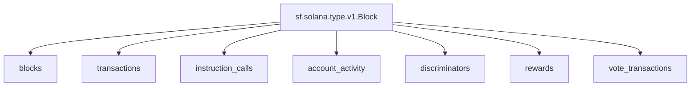

## `Solana` Raw Blockchain Data

> Solana
> [`sf.solana.type.v1.Block`](https://buf.build/streamingfast/firehose-solana/docs/main:sf.solana.type.v1)

- [ ] **Blocks**
- [ ] **Transactions**
- [ ] **Instruction Calls**
- [ ] **Account Activity**
- [ ] **Discriminators**
- [ ] **Rewards**
- [ ] **Vote Transactions**

