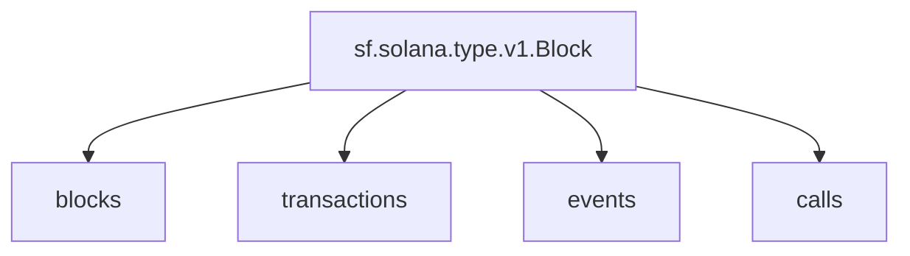

## `Starknet` Raw Blockchain Data

> Starknet
> [`sf.starknet.type.v1.Block`](https://buf.build/streamingfast/firehose-starknet/docs/main:sf.starknet.type.v1)

- [x] **Blocks**
- [x] **Transactions**
- [x] **Events**
- [] **Calls**

