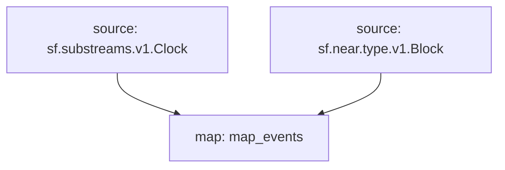

## `Starknet` Raw Blockchain Data

> Starknet
> [`sf.starknet.type.v1.Block`](https://buf.build/streamingfast/firehose-starknet/docs/main:sf.starknet.type.v1)

- [x] **Blocks**
- [x] **Transactions**
- [x] **Events**
- [ ] ~~**Calls**~~

## Graph



## Modules

```bash
Name: map_events
Initial block: 0
Kind: map
Input: source: sf.substreams.v1.Clock
Input: source: sf.near.type.v1.Block
Output Type: proto:pinax.near.v1.Events
Hash: a39362e4e3ae6ee3b4a3690b5995e2b369237721
```
